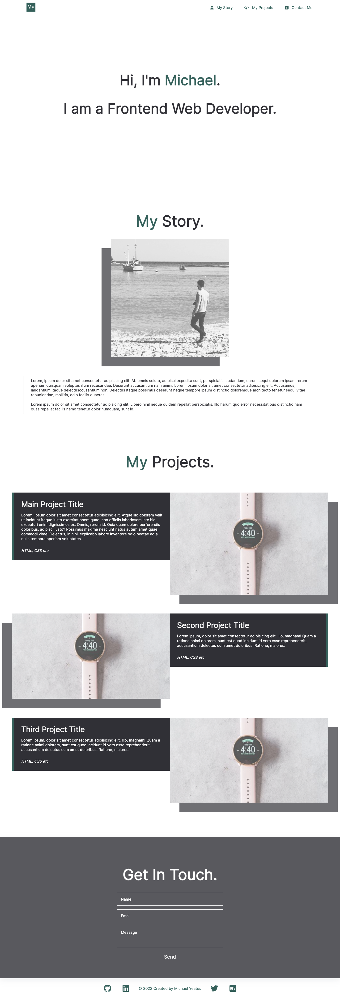
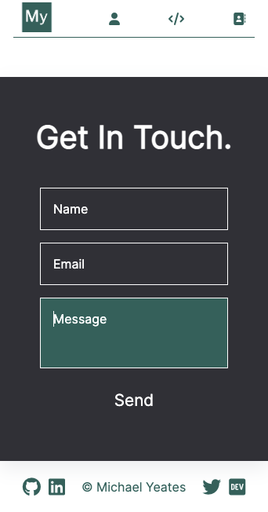
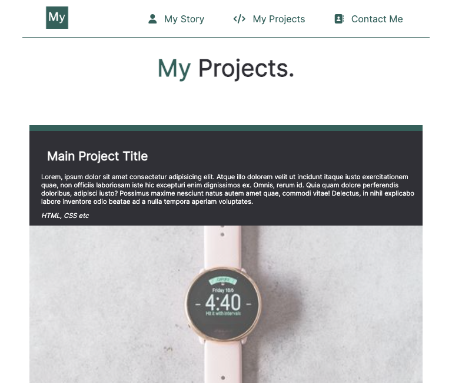

# Portfolio
## Description

A website development portfolio I created for a bootcamp assignment using HTML and CSS. The various sections use both flexbox and grid. I will replace the placeholder images and text once I have developed some applications to talk about. 

* This page presents my name, a photo and links to sections about me, my work and a contact form
* As the links are clicked, the UI scrolls smoothly to the corresponding section
* The work section contains titled placeholder images for my future applications
* A larger image is displayed for the main application
* My sections include icons, links, and images that use hover and transition functions
* The application images are clickable (currently takes you to my github repo) and will take you to the deployed application when I have created them
* I have used media queries to ensure compatibility with a number of different devices

[A link to the deployed website](https://mdyeates.github.io/portfolio/)

## Installation

N/A

## Usage

Users can access this website from a variety of devices. In order to ensure that the layout is compatible with smaller devices such as smartphones and tablets, I have used media queries. 

## Credits and Resources

[Font Awesome (Icons)](https://fontawesome.com/)

[Lorem Space (Placeholder images)](https://lorem.space/)

[CSS Tricks](https://css-tricks.com/)

[Net Ninja](https://www.youtube.com/watch?v=3tLb3i7GB38&list=PL4cUxeGkcC9g9Vh9MAA-XKnfJsWZnPZFw)

[Media Queries](https://www.youtube.com/watch?v=2KL-z9A56SQ)

## Contact

## License

For more information, please refer to the LICENSE in the repo.